```{r setup, include=FALSE}
knitr::opts_chunk$set(echo = TRUE)
```

# Introduction

In comparative RNA sequencing (RNA-seq) experiments, selecting the appropriate sample size is an important optimization step [1]. Empirical RNA-seq Sample Size Analysis (ERSSA) is a R software package designed to test whether an existing RNA-seq dataset has sufficient biological replicates to detect a majority of the differentially expressed genes (DEGs) between two conditions. In contrast to existing RNA-seq sample size analysis algorithms, ERSSA does not rely on any a priori assumptions about the data [2]. Rather, ERSSA takes a user-supplied RNA-seq sample set and evaluates the incremental improvement in identification of DEGs with each increase in sample size up to the total samples provided, enabling the user to determine whether sufficient biological replicates have been included.

Based on the number of replicates available (N for each of the two conditions), the algorithm subsamples at each step-wise replicate levels (n= 2, 3, 4, ..., N-1) and uses existing differential expression (DE) analysis software (e.g., edgeR [8] and DESeq2 [9]) to measure the number of DEGs. As N increases, the set of all distinct subsamples for a particular n can be very large and experience with ERSSA shows that it is not necessary to evaluate the entire set.  Instead, 30-50 subsamples at each replicate level typically provide sufficient evidence to evaluate the marginal return for each increase in sample size. If the number of DEGs identified is similar for n = N-2, N-1 and N, there may be little to be gained by analyzing further replicates. Conversely, if the number of DEGs identified is still increasing strongly as n approaches N, the user can expect to identify significantly more DEGs if they acquire additional samples. 

When applied to a diverse set of RNA-seq experimental settings (human tissue, human population study and in vitro cell culture), ERSSA demonstrated proficiency in determining whether sufficient biological replicates have been included. Overall, ERSSA can be used as a flexible and easy-to-use tool that offers an alternative approach to identify the appropriate sample size in comparative RNA-seq studies.

# Installation

Install the latest stable version of ERSSA by entering the following commands in R console:

```{r, eval=FALSE}
if (!requireNamespace("BiocManager", quietly = TRUE))
    install.packages("BiocManager")

BiocManager::install("ERSSA")
```

# Usage

## Utility

In this vignette, we demonstrate ERSSA’s analytical approach using an RNA-seq dataset containing 10 human heart samples and 10 skeletal muscle samples from GTEx [3] and ask whether 10 replicates are sufficient to identify a majority of DE genes (adjusted p-value < 0.05 and |log2(fold-change)| > 1). At the end of the ERSSA run, four plots are generated to summarize the results. For now, let’s briefly focus on the most important of these, the number of DEGs identified as a function of the number of replicates included in the analysis. In the present example, the average number of DEGs discovered increases approximately 3% from n=6 to n=7 and little to no improvement as n increases to 8 and beyond. This suggests that our example dataset with N=10 replicates is sufficient to identify the vast majority of DEGs. To verify this conclusion, an additional 15 human heart and 15 skeletal muscle samples from GTEx were added and the analysis was repeated with N=25.  The results for n<10 obtained with N=25 gave similar mean and distribution of the number of DEGs identified as those obtained with N=10, validating the utility of the statistical subsampling approach. The rest of this vignette will further explore ERSSA’s functionalities using the 10-replicate GTEx heart vs. muscle dataset. We will also briefly go through two additional examples that help to illustrate the variety of experimental settings where ERSSA can be applied.


```{r, out.width = "500px", echo=FALSE, fig.align = "center"}
knitr::include_graphics("Figures/GTEx/ERSSA_plot_1_NumOfDEGenes_N10_title.png")
```

```{r, out.width = "500px", echo=FALSE, fig.align = "center"}
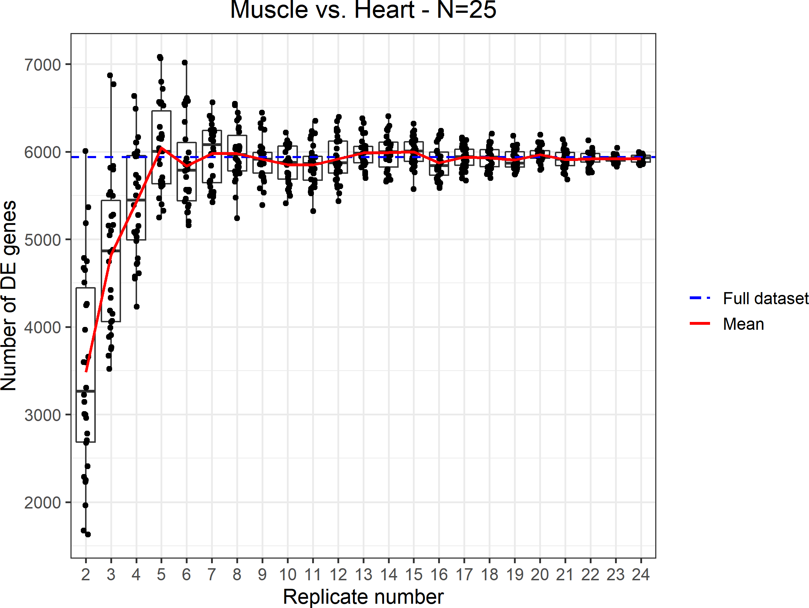
```

## Load example data

First, let's load the N=10 GTEx heart and muscle dataset into the R workspace. The data can be loaded into R directly from the ERSSA package using:

```{r}
library(ERSSA)

# GTEx dataset with 10 heart and 10 muscle samples
# "full"" dataset contains all ensembl genes
data(condition_table.full)
data(count_table.full)

# For test purposes and faster run time, we will use a smaller "partial" dataset
# 4 heart and 4 muscle samples
# partial dataset contains 1000 genes
data(condition_table.partial)
data(count_table.partial)

# NOTE: the figures are generated from the "full" dataset
```

The original dataset was obtained from the recount2 project [6], which is a systematic effort to generate gene expression count tables from thousands of RNA-seq studies. To generate the objects loaded above, GTEx heart and muscle count tables were manually downloaded from the [recount2 website](https://jhubiostatistics.shinyapps.io/recount/) and processed by the recount package. The first 10 samples were then selected and a corresponding condition table generated to complete this example dataset. 

For any ERSSA analysis, we need a few essential inputs. First is the RNA-seq count table that contains genes on each row and samples on each column. ERSSA expects the input count table as a dataframe object with gene names as the index and sample IDs as column names. For example, the first few cells of our example count table looks like this:

```{r}
head(count_table.full[,1:2])
```

Next, we need to supply a condition table in the form of a dataframe object that contains two columns and the same number of rows as the total number of samples. Column one contains the sample IDs exactly as they appear in the count tables and column two contains the corresponding condition names. Only two conditions are supported. Our full condition table is shown below:

```{r}
condition_table.full
```

Finally, we need to specify which condition to use as the control in the DE comparison. In this case, let’s set “heart” as the control condition.

## Run ERSSA

With the count and condition tables prepared, we can now call the main `erssa` wrapper function to start the sample size analysis:

```{r, message=FALSE, warning=FALSE}
set.seed(1) # for reproducible subsample generation

ssa = erssa(count_table.partial, condition_table.partial, DE_ctrl_cond='heart')

# Running full dataset is skipped in the interest of run time
# ssa = erssa(count_table.full, condition_table.full, DE_ctrl_cond='heart')
```

With this command, the `erssa` wrapper function calls various ERSSA functions to perform the following calculations in sequence:

1. Filter the count table by gene expression level to remove low-expressing genes.

2. Generate unique subsamples (sample combinations) at each replicate level.

3. Call one of the DE packages to perform DE analysis. Identify the genes that pass test statistic and fold change cutoffs. 

4. Generate plots to visualize the results.


By default, the `erssa` wrapper function will save the generated plots plus all of the generated data in the current working directory. An alternative path can be set using the `path` argument.

Note that, under default setting, the ERSSA calculations may require runtime in order of minutes. This is because for each subsample, a DE analysis is performed by calling the DE software. Thus, runtime is scaled linearly to the number of calls to the DE software and when hundreds of comparisons (in our example dataset: 8 replicate levels * 30 subsamples per level) need to be done, the entire calculation can take some time to complete. Fortunately, this issue can be mitigated by running the DE calculations in parallel (ERSSA uses the `BiocParallel` package to manage this [7]). This along with other ERSSA capabilities are further explained in the next section.

## ERSSA in more detail

In this section, the steps `erssa` take are explained in more detail. Additionally, we will also cover the parameters that can be set to optimize the analysis for each user’s specific needs. Full descriptions and usage examples can be found in each function’s manual.

### Filter count table

First, `erssa` calls the function `count_filter` to remove low-expressing genes from the count table. Filtering away low-expressing genes before differential expression comparison is a widely accepted practice and should be performed here to maximize discovery [4]. A gene-wise average Count Per Million (CPM) calculation is performed and at default, all genes with average CPM below 1 are removed from further analysis. The default CPM cutoff can be changed by adjusting the argument `filter_cutoff`. Additionally, if the user prefers to perform their own gene filtering prior to ERSSA (e.g., with the genefilter package [5]), a pre-filtered count table can be supplied and gene filter by ERSSA turned off by setting the argument `counts_filtered=TRUE`. 

### Generate subsample combinations

Next, ERSSA runs `comb_gen` function to randomly generate the subsample combinations. Briefly, at each replicate level (n=2 to N-1), this function employs a random process to sample from the entire dataset to generate at most 30 (at default) unique subsample combinations per condition. Note that only unique sample combinations are kept; so in the case where we select 5 samples out of 6 total replicates, only 6 unique combinations will be generated. Finally, at most 30 unique pairs of control vs. experimental samples are randomly selected for DE analysis by combining the lists from both conditions.

The number of subsample combinations per replicate level can be set with the `comb_gen_repeat` argument. The default value of 30 is based on the observation that for a majority of datasets we have analyzed, 30 combinations proved sufficient to expose the trend in the DE gene discovery as a function of replicate level n. However, we also noticed that for certain datasets with particularly high biological variance, ERSSA benefits from running additional combinations at the expense of longer runtime.  

Since a random process is employed, each individual `erssa` run will generate an unique set of subsamples as long as all of the unique combinations have not been exhausted as set by the `comb_gen_repeat` argument. However, deterministic results can be achieved by setting the random seed through `set.seed(seed)` before running `erssa`. For example, we can exactly reproduce the plot in section 3.1 using `set.seed(1)`. Generally, we found it useful to run several random seeds to confirm the overall conclusions are consistent across individual runs.

### Start DE analysis

For each subsample (selected pair of control and experiment combinations generated), ERSSA calls a DE software such as edgeR or DESeq2 to perform the DE analysis. At default, edgeR is used as it is slightly faster in runtime compare to DESeq2. Alternatively, DESeq2 can be used instead of edgeR by including the argument: `DE_software='DESeq2'`. The analysis is done under the hood by either `erssa_edger` or `erssa_deseq2` function. For now, only edgeR and DESeq2 are supported as they are two of the most widely used DE software. Additional DE packages can be added in the future.

As previously noted, ERSSA runtime can be significantly shortened by running the DE comparisons in parallel. To do this, ERSSA relies on the `BiocParallel` package with the number of workers (CPUs) set using the `num_workers` argument. Running parallel DE tests in ERSSA is handled by `erssa_edger_parallel` or `erssa_deseq2_parallel` functions. 

One of the main goals of ERSSA is to identify the number of DE genes in each of the sample combinations. At default, the genes with adjusted p-value (or FDR) < 0.05 and |log2(fold-change)| > 1 are considered to be differentially expressed. Alternatively, the user can specify a more stringent p-value cutoff using the `DE_cutoff_stat` argument. Likewise, the |log2(fold-change)| cutoff can be set with the `DE_cutoff_Abs_logFC` argument. The latter may be necessary when the expected gene expression differences between the conditions are relatively small (e.g., weak stimulation of cells compare to control cells). 

Once the DE genes have been identified, the DE analysis tables of results such as fold change, test statistics, etc., are not saved in an effort to conserve disk space. If one wishes to retain these results, the tables can be saved as csv files in a new folder in the path specified by setting `DE_save_table=TRUE`.


### Plot results

Based on the DE analyses, ERSSA generates four summary plots to help the user interpret the results. The first plot (generated by `ggplot2_dotplot` function) displays the number of DEGs discovered in each differential comparison grouped by the number of replicates employed. Boxplots are used to summarize the data while a red solid line represents the mean number of DEGs across the replicate levels. Lastly, a blue dashed line indicates the number of DEGs discovered with the full dataset.

```{r, out.width = "500px", echo=FALSE, fig.align = "center"}
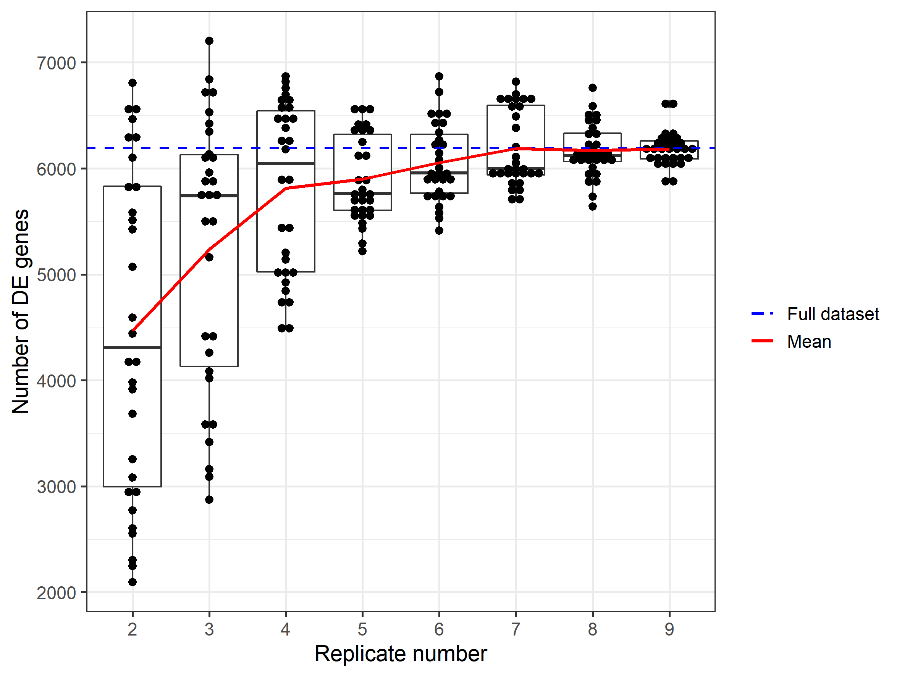
```

In the plot above, the dashed blue line shows that when the full dataset (10 GTEx heart vs. 10 muscle samples) is analyzed, edgeR detects around 6200 DE genes with FDR < 0.05 and |log2(fold-change)| > 1. As expected, the average number of DEG identified increases with the number of replicates used in the analysis. For n>6 replicates, the average number of DEGs identified match closely the number found using the full dataset (N=10). Based on this plot, we can make the interpretation that 7 or more replicates are likely sufficient to discover a majority of genes that are differentially expressed between the two conditions tested. 

The next plot ERSSA generates shows the percent difference in the median number of DEGs identified as a function of the number of replicates (generated by `ggplot2_marginPlot` function). Initially (e.g., increasing of n from 2 to 3), while noisy, each additional replicate improve the DEG discovery.  At the other end, the marginal change in the average number of DEG identified becomes very small (less than 1% change when increasing n to 8 from 7, to 9 from 8 and to 10 from 9). This plot reinforces the conclusion that increasing the number of replicates beyond 7 hardly changes the median number of DEGs identified. While the median is plotted by default, the user can select to plot the mean by setting `marginalPlot_stat='mean'`. 

```{r, out.width = "500px", echo=FALSE, fig.align = "center"}
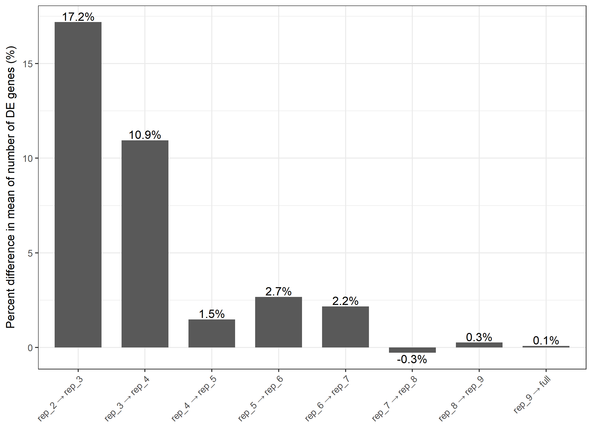
```

The third plot shows the number of DEGs that are identified in all of the DE tests (the interesect) at a particular replicate level (generated by `ggplot2_intersectPlot` function). Here, we typically see increasing the number of replicates used increases the number of genes that are identified in all tests. This plot mainly helps the user understand the amount of consistency among all of the subsample combinations tested at each replicate level. Additionally, it might be interesting to further investigate the 4,942 DE genes that are discovered in all 30 DE tests with 9 replicates. This list of high confidence DEGs is perhaps more reliable than the list discovered with the full dataset. Please refer to the manual page of the function `ggplot2_intersectPlot` to learn more about how to extract these intersecting gene lists. 

```{r, out.width = "500px", echo=FALSE, fig.align = "center"}
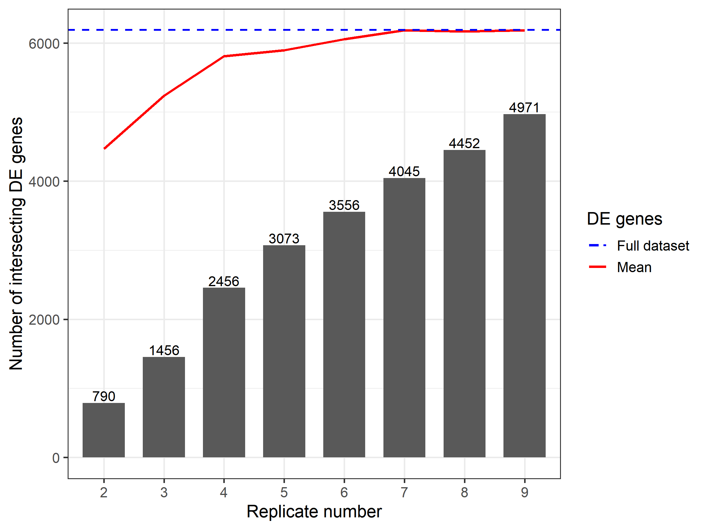
```

The last plot helps to visualize the True Positive Rate (TPR) and False Positive Rate (FPR) as a function of the number of replicates (generated by `ggplot2_TPR_FPRPlot` function). Here, we set the list of DEGs found using the full dataset as the ground truth. It is worth noting that using the full dataset as the ground truth may not be appropriate for all datasets. This is especially true when the dataset is under powered to identify the DEGs between conditions. 

In the TPR, FPR plot, the dots show the (TPR, FPR) for each of the subsamples analyzed while the black-bordered diamond shows the mean (TPR, FPR) at each replicate level. Alternatively, the median can be plotted by setting `TPR_FPR_stat='median'`. Notice that, at small numbers of replicates, both TPR and FPR increase. Only when the number of replicates is sufficiently large (here n>3) does increasing number of replicates provide the expected increase of TPR and decrease of FPR. Similar to the intersect DE genes plot, the TPR-FPR plot helps the user understand the variability among the DE tests. In this particular dataset, we see TPR improved substantially with at least 5 replicates while the improvement past 7 replicates becomes increasingly marginal.

```{r, out.width = "500px", echo=FALSE, fig.align = "center"}
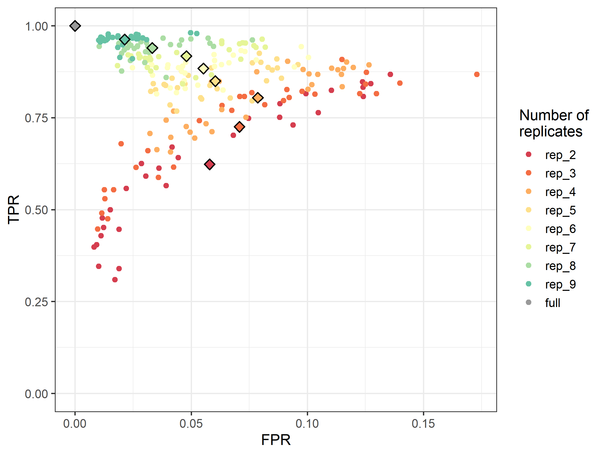
```

All four of the plots above are generated by ERSSA using the ggplot2 package [13] with the ggplot2 objects as well as the plotted data saved to disk. From there, the user can easily replace commands or add new ones to customize the plots according to their preference. Additionally, the raw data generated during the calculations are available to the user to generated additional plots not included in the ERSSA package. The following codes serve as a simple demonstration of the customization capability based on ggplot2.

```{r, message=FALSE, warning=FALSE}
library(ggplot2)

# Parse out plot 1
de_plot = ssa$gg.dotPlot.obj$gg_object 
# Change y-axis label to be more descriptive
de_plot = de_plot + ylab('Number of differentially expressed genes')

# Save the plot in the current working directory with new dimensions and a
# lower resolution.
ggsave(filename='ERSSA_plot_1_NumOfDEGenes.png',
     plot=de_plot, dpi=100, width = 15,
     height = 10, units = "cm")
```

```{r, out.width = "500px", echo=FALSE, fig.align = "center"}
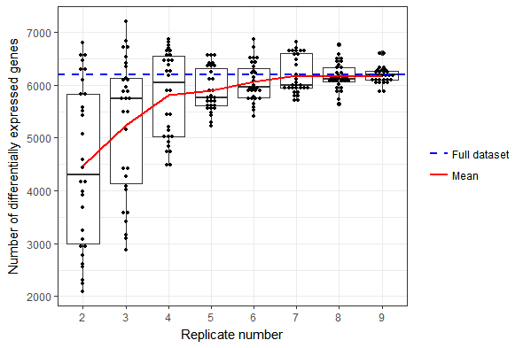
```

## Additional examples

### Human population dataset

Comparison of two human populations illustrates the value of ERSSA when one is confronted with data sets that have a high degree of biological variability. The data for this example is available as part of the International HapMap Project, which performed RNA-seq on lymphoblastoid cell lines derived from 60 European and 69 Nigerian individuals [10,11]. Here, we manually downloaded preprocessed count and condition tables from the original [ReCount project](http://bowtie-bio.sourceforge.net/recount/) to serve as inputs for ERSSA. In this case, running ERSSA on the entire dataset is quite time consuming as well as unnecessary, so 25 replicates from each group were selected for ERSSA analysis.

Compare to the previous GTEx dataset that compared heart to muscle, the HapMap dataset's DEG discovery increased much more slowly with additional replicates. It is also worth noting the large variability in the discovery when few replicates are used. For this dataset, the number of subsample combinations tested was increased from the default 30 to 50 to reduce the algorithm's sensitivity to outliers in any particular replicate level. Unlike the GTEx dataset, we see that at least 15 replicates are needed to capture a majority of DEGs. Additionally, the mean discovery line hovers near the full dataset line past 17 replicates, serving as a good indication that we already have sufficient replicates to discovery a majority of DEGs. 

```{r, out.width = "500px", echo=FALSE, fig.align = "center"}
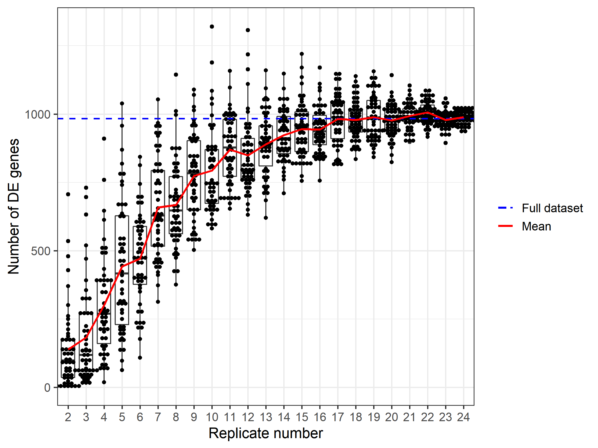
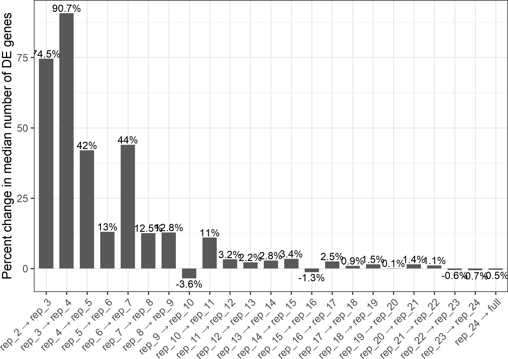
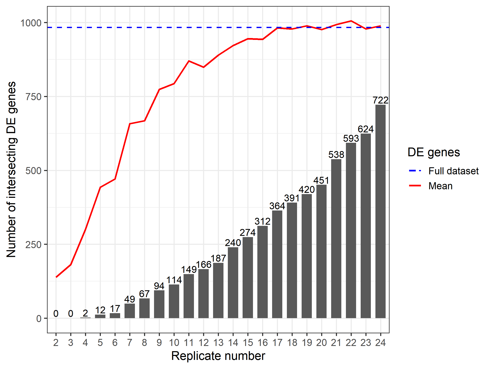
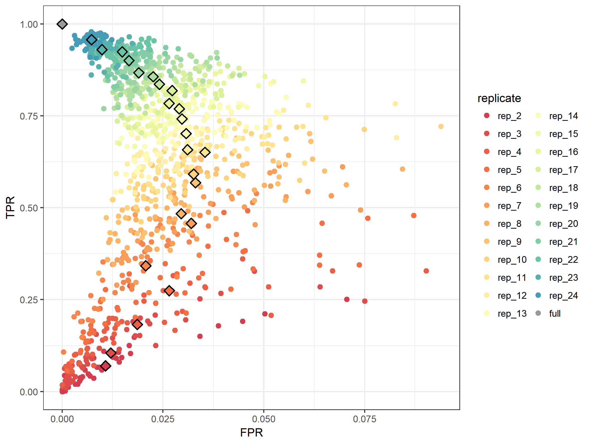
```


### Cell culture dataset

In this example, data were obtained by Fossum and coworkers in a study of the transcriptome response to regulation of an E26-related transcription factor, ETS homologous factor (EHF) [12]. As part of the study, EHF expression was depleted using siRNA and compared to negative control siRNA samples. For both conditions, 5 cell culture replicates were used (representative of the typical number of replicates used in most RNA-seq studies). Count and condition tables from [recount2 website](https://jhubiostatistics.shinyapps.io/recount/) will serve as inputs for ERSSA. Here are the ERSSA plots with the 5 replicates dataset:


```{r, out.width = "500px", echo=FALSE, fig.align = "center"}
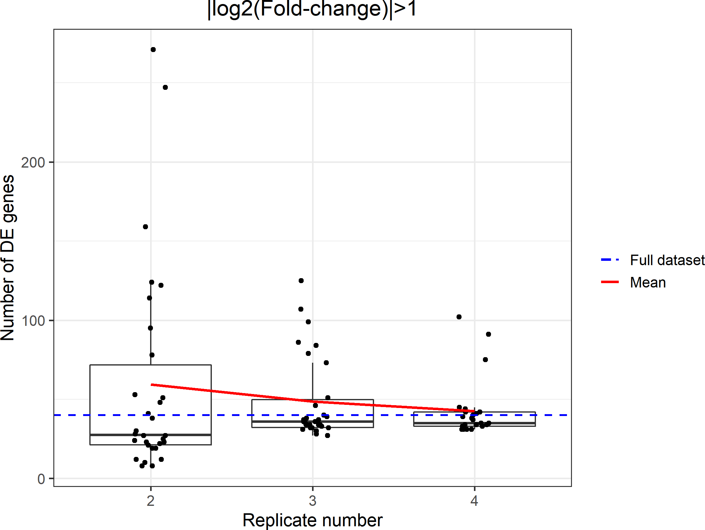
```

For this particular comparison, we found very few DEGs with |log2(fold-change)| > 1, so the cutoff is adjusted to 0.5. 

```{r, out.width = "500px", echo=FALSE, fig.align = "center"}
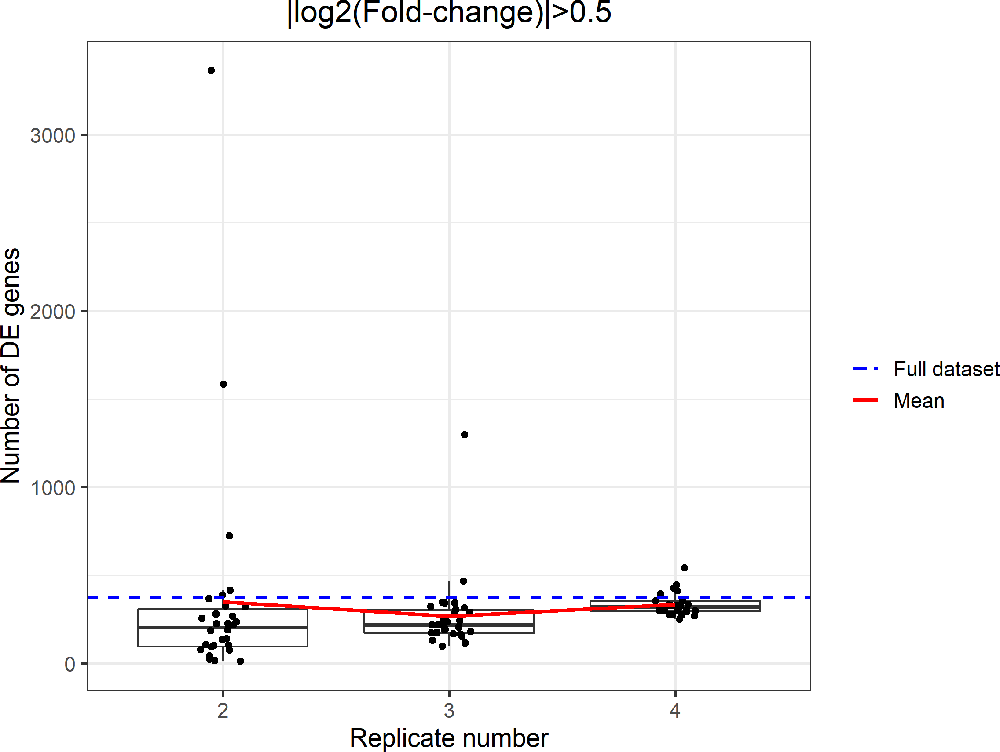
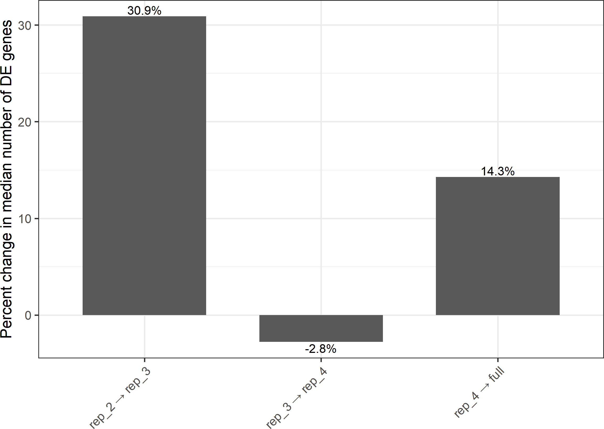
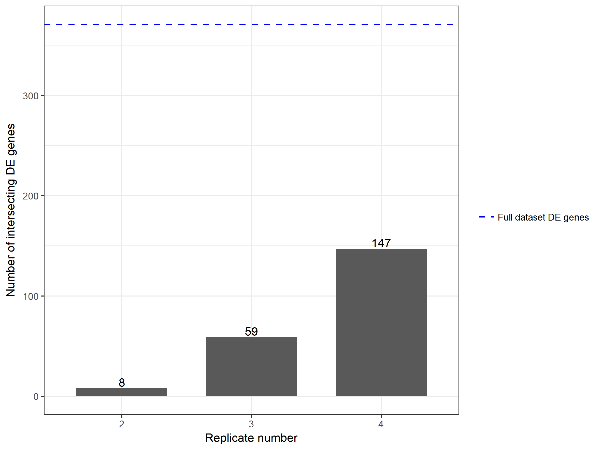
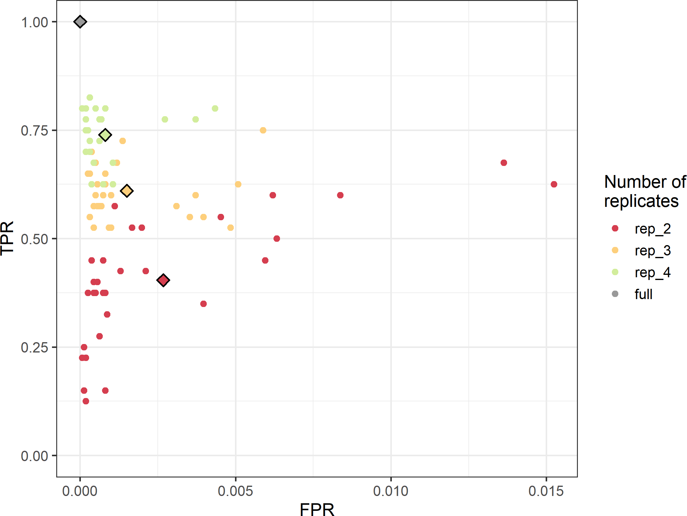
```

In contrast to the two previous datasets, ERSSA plots suggest this study would benefit from including additional replicates. In the percent difference plot, moving from 4 replicates to 5 replicates improved discovery significantly by 14.3%. Base on the trend, adding additional replicates will likely to continue improve DEG discovery by high single digit percentages. Additionally, the TPR-FPR plot shows the mean TPR measured with 4 replicate subsamples is quite low at around 0.75. Of course, the caveat here is that since the discovery would most likely benefit from including additional replicates, the list of DEGs from the full dataset (N=5) is a poor representation of the ground truth. While, in certain cases, including additional replicates may not be feasible or economical, ERSSA allows user to answer the question whether their DE analysis would benefit from more biological replicates.


# Built with
```{r}
sessionInfo()
```


# References

1. Ching, Travers, Sijia Huang, and Lana X. Garmire. “Power Analysis and Sample Size Estimation for RNA-Seq Differential Expression.” RNA, September 22, 2014. https://doi.org/10.1261/rna.046011.114.

2. Hoskins, Stephanie Page, Derek Shyr, and Yu Shyr. “Sample Size Calculation for Differential Expression Analysis of RNA-Seq Data.” In Frontiers of Biostatistical Methods and Applications in Clinical Oncology, 359–79. Springer, Singapore, 2017. https://doi.org/10.1007/978-981-10-0126-0_22.

3. Melé, Marta, Pedro G. Ferreira, Ferran Reverter, David S. DeLuca, Jean Monlong, Michael Sammeth, Taylor R. Young, et al. “The Human Transcriptome across Tissues and Individuals.” Science 348, no. 6235 (May 8, 2015): 660–65. https://doi.org/10.1126/science.aaa0355.

4. Anders, Simon, Davis J. McCarthy, Yunshun Chen, Michal Okoniewski, Gordon K. Smyth, Wolfgang Huber, and Mark D. Robinson. “Count-Based Differential Expression Analysis of RNA Sequencing Data Using R and Bioconductor.” Nature Protocols 8, no. 9 (September 2013): 1765–86. https://doi.org/10.1038/nprot.2013.099.

5. Gentleman R, Carey V, Huber W, Hahne F (2018). genefilter: genefilter: methods for filtering genes from high-throughput experiments. R package version 1.62.0.

6. Collado-Torres, Leonardo, Abhinav Nellore, Kai Kammers, Shannon E. Ellis, Margaret A. Taub, Kasper D. Hansen, Andrew E. Jaffe, Ben Langmead, and Jeffrey T. Leek. “Reproducible RNA-Seq Analysis Using Recount2.” Nature Biotechnology 35, no. 4 (April 2017): 319–21. https://doi.org/10.1038/nbt.3838.

7. Morgan M, Obenchain V, Lang M, Thompson R, Turaga N (2018). BiocParallel: Bioconductor facilities for parallel evaluation. R package version 1.14.1, https://github.com/Bioconductor/BiocParallel.

8. Robinson MD, McCarthy DJ, Smyth GK (2010). “edgeR: a Bioconductor package for differential expression analysis of digital gene expression data.” Bioinformatics, 26(1), 139-140.

9. Love MI, Huber W, Anders S (2014). “Moderated estimation of fold change and dispersion for RNA-seq data with DESeq2.” Genome Biology, 15, 550. doi: 10.1186/s13059-014-0550-8.

10. Montgomery, Stephen B., et al. "Transcriptome genetics using second generation sequencing in a Caucasian population." Nature 464.7289 (2010): 773.

11. Pickrell, Joseph K., et al. "Understanding mechanisms underlying human gene expression variation with RNA sequencing." Nature 464.7289 (2010): 768.

12. Fossum, Sara L., et al. "Ets homologous factor regulates pathways controlling response to injury in airway epithelial cells." Nucleic acids research 42.22 (2014): 13588-13598.

13. H. Wickham. ggplot2: Elegant Graphics for Data Analysis. Springer-Verlag New York, 2009.
