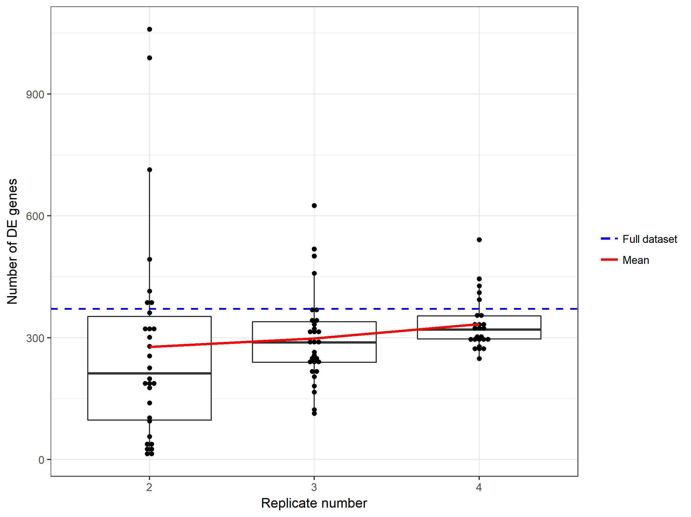

```{r setup, include=FALSE}
knitr::opts_chunk$set(echo = TRUE)
```

# Introduction

Sample size calculation is an important optimization step in any comparative RNA sequencing (RNA-seq) experiment [1]. Empirical RNA-seq Sample Size Analysis (ERSSA) is a R software package designed to test whether an existing RNA-seq dataset has sufficient biological replicates to detect a majority of the differentially expressed genes (DEGs) between two conditions. Compare to existing RNA-seq sample size analysis algorithms, ERSSA does not rely on any a priori assumptions about the data [2]. Rather, ERSSA takes an user-supplied RNA-seq sample set and determines whether sufficient biological replicates have been included. 

Base on the number of replicates already available, the algorithm subsamples at step-wise replicate levels and uses existing differentially expression (DE) analysis softwares (e.g. edgeR [8] and DESeq2 [9]) to identify the number of DEGs at each level. This process is repeated for a sufficient number of times with unique combinations of samples to generate a distribution of the number of DEGs at each replicate level. Once all of the DE comparisons have been processed, the DEG numbers are then plotted and base on the trend in the plot, the user can assess whether sufficient biological replicates have been employed.

When applied to RNA-seq data from studies including GTEx [3], ERSSA demonstrated proficiency in determining whether sufficient biological replicates have been included. Overall, ERSSA can be used as a flexible and easy-to-use tool that offers an alternative approach to identify the appropriate sample size in comparative RNA-seq studies.


# Installation

Install the latest stable version of ERSSA by entering the following commands in R console:

```{r, eval=FALSE}
source("https://bioconductor.org/biocLite.R")
biocLite("ERSSA")
```

# Usage

## Utility

In this vignette, we will demonstrate ERSSA's analytical approach using a dataset containing 10 healthy human heart and muscle RNA-seq samples from GTEx and ask whether 10 replicates are sufficient to identify a majority of DE genes (adjusted p-value < 0.05 and absolute log(2) fold-change > 1). At end of the ERSSA run, four plots are generated to summarize the results with the most important one shown below. In this plot, we visualize the number of DE genes in each comparison grouped by the number of replicates used. Base on the trend in the plot, we can conclude that 10 biological replicates is likely enough as majority of DE genes have already been discovered with 7-8 replicates. Additional analysis with a larger 25 replicate dataset reached the same conclusion demonstrating the utility of this approach. The rest of this vignette will further explore ERSSA's functionalities using the 10 replicate GTEx dataset.

```{r, out.width = "500px", echo=FALSE, fig.align = "center"}
knitr::include_graphics("Figures/GTEx/ERSSA_plot_1_NumOfDEGenes.png")
```

## Load example data

The ERSSA package conviniently includes a wrapper function named "erssa" that performs all of the major functions. First, let's load the ERSSA package:

```{r}
library(ERSSA)
```

Next, let's load the 10 replicate GTEx muscle and heart dataset. The data can be loaded into R directly from the ERSSA package using:

```{r}
data(condition_table.full, package="ERSSA")
data(count_table.full, package="ERSSA")
```

The original dataset was obtained from the recount2 project [6] which is a systematic effort to generate gene expression count tables from thousands of RNA-seq studies. Here, GTEx heart and muscle count tables were manually downloaded from the [recount2 website](https://jhubiostatistics.shinyapps.io/recount/) and processed by the recount package. The first 10 samples were then selected and a corresponding condition table generated to complete this example dataset. The following code was used to generate the condition and count tables we just loaded into R.

```{r, eval=FALSE}
library(recount) #recount package to scale recount raw counts

load('rse_gene_heart.Rdata') # load manually downloaded heart count table
rse = recount::scale_counts(rse_gene) # use recount package to scale the counts
counts = assays(rse)$counts # parse out the counts
#select first 10 samples
samples_heart=colnames(counts)[
    order(nchar(colnames(counts)), colnames(counts))][1:10] 
selected_counts_heart = counts[,samples_heart]

# repeat for muscle
load('rse_gene_muscle.Rdata')
rse = recount::scale_counts(rse_gene)
counts = assays(rse)$counts
samples_muscle=colnames(counts)[
    order(nchar(colnames(counts)), colnames(counts))][1:10]
selected_counts_muscle = counts[,samples_muscle]

# add sample conditions to sample names in both count table and sample list
samples_heart = sapply(samples_heart, function(x)
    paste0('heart_', x), USE.NAMES = F)
samples_muscle = sapply(samples_muscle, function(x)
    paste0('muscle_', x), USE.NAMES = F)

colnames(selected_counts_heart) = sapply(
    colnames(selected_counts_heart), function(x)
    paste0('heart_', x), USE.NAMES = F)
colnames(selected_counts_muscle) = sapply(
    colnames(selected_counts_muscle), function(x)
    paste0('muscle_', x), USE.NAMES = F)

# merge heart and muscle count tables
count_table = as.data.frame(cbind(selected_counts_heart,
                                  selected_counts_muscle))
# create condition table
condition_table = data.frame(name=c(samples_heart, samples_muscle),
                             condition=c(rep('heart',25), rep('muscle', 25)))
```

For any ERSSA analysis, we need a few essential inputs. First is the RNA-seq count table that contains genes on each row and samples on each column. ERSSA expects the input count table as a dataframe object with gene names as the index and sample IDs as column names. For example, the first few cells of our example count table looks like this:

```{r}
head(count_table.full[,1:2])
```

Next, we need to supply a condition table in form of a dataframe object that contains two columns and same number of rows as samples. Column one contains the sample IDs while column two contains the corresponding condition names. Importantly, sample IDs must match between condition and count tables. Additionally, only two conditions are supported. Our full condition table is shown below:

```{r}
condition_table.full
```

Finally, we need to specify which condition is the control condition to be used in the DE comparison. In this case, let's set "heart" as the control condition.

## Run ERSSA

With the count and condition tables prepared, we can now call `erssa` to start the sample size analysis:

```{r, eval=FALSE}
set.seed(1) # for reproducible sample combination generation
ssa = erssa(count_table.full, condition_table.full, DE_ctrl_cond='heart')
```

With this command, the `erssa` wrapper function calls various sub-functions to performs the following calculations in sequence:

1. Filter count table by gene expression level to remove low-expressing genes.

2. Generate unique sample combinations at each replicate level.

3. Call one of the DE softwares to perform DE analysis. Identify the genes that pass test statistic and fold change cutoffs. 

4. Generate plots to visualize the results.


By default, the `erssa` wrapper function will save the generated plots plus all of the generated data in the current working directory. An alternative path can be set using the `path` argument.

Additionally, it may take a while to complete all of the calculations. This is because for each sample combination, a DE analysis is performed by calling the DE software. As a result, runtime is scaled linearly to the number of calls to the DE software. In this case, when hundreds of comparisons (8 replicate levels * 30 combinations at default) need to be done, the entire calculation can become quite time consuming. Fortunately, this issue can be easily resolved by running the DE comparisons in parallel. To do this, ERSSA takes advantage of the `BiocParallel` package to run the DE analysis steps in parallel [7]. This along with other ERSSA capabilities are further explained in the next section.

## ERSSA in more detail

In this section, the steps `erssa` take will be explained in more detail. Additionally, we will also cover additional parameters that can be set to fit the analysis to each user's specific needs. Full descriptions and usage examples can be found in each function's manual.

### Filter count table

In the first step, `erssa` calls `count_filter` to remove low-expressing genes from the count table. A gene-wise average Count Per Million (CPM) calculation is performed and at default, all genes with average CPM below 1 are removed from further analysis. Filtering away low-expressing genes before differential expression comparison is a widely accepted practice and should be performed here to maximize discovery [4]. The default CPM cutoff can be changed by adjusting the argument `filter_cutoff`. Additionally, if the user perfers to perform their own gene filtering prior to ERSSA (e.g. with the genefilter package [5]), a pre-filtered count table can be supplied and gene filter by ERSSA turned off by setting the argument `counts_filtered=TRUE`. 

### Generate sample combinations

Next, ERSSA runs `comb_gen` function to randomly generate the sample combinations. Briefly, at each sub-full replicate level (2 to full-1 replicates), this function employs a random process to sample from the "full" dataset to generate at most 30 unique combinations per level. This step is repeated for both conditions resulting in 2 sets of at most 30 unique combinations. Note that only unique sample combinations are kept; so in the case where we sub-sample 5 samples out of 6 total replicates, only 6 unique combinations that will be generated. Finally, the 2 sets of combinations are randomly merged to form at most 30 unique combinations of control vs. experimental samples. Again, only unique combinations are kept and there may be less than 30 in total per replicate level.

For a majority of datasets we have tested, 30 combinations are typically sufficient to visualize the trend in the DE gene discovery. However, we also noticed that for certain datasets with particuarly high biological variance, ERSSA benefits from running additional combinations at the expense of longer runtime. The number of combinations per replicate level can be set with the `comb_gen_repeat` argument.

Since a random process is used to generate the combinations, each individual `erssa` run will generate an unique set of sample combinations as long as all of the unique combinations have not been exhausted as set by the `comb_gen_repeat` argument. However, reproducible results can be achieved by setting the random seed through `set.seed(seed)` before running `erssa`. For example, we can reproduce the plot in section 3.1 using `set.seed(1)`. Additionally, we found it useful to run several random seeds to confirm the overall conclusions are consistent across individual runs.

### Start DE analysis

For each sample combination generated, ERSSA calls a DE software such as edgeR or DESeq2 to perform the DE analysis. At default, edgeR is used as it is slightly faster in runtime compare to DESeq2. Alternatively, DESeq2 can be used instead of edgeR by including the argument: `DE_software='DESeq2'`. The entire process is done under the hood by either `erssa_edger` or `erssa_deseq2` function. For now, only edgeR and DESeq2 are supported as they are two of the most widely used DE softwares. More DE packages can be easily added in the near future. 

As previously noted, ERSSA runtime can be significantly shortened by running the DE comparisons in parallel. To do this, ERSSA relies on the `BiocParallel` package with the number of workers (CPUs) set using the `num_workers` argument. Running parallel processing in ERSSA is handled by `erssa_edger_parallel` or `erssa_deseq2_parallel` functions. 

One of the main goals of ERSSA is to identify the DE genes among each sample combination. At default, the genes with adjusted p-value (or FDR) < 0.05 and absolute log2 fold-change > 1 are considered to be differentially expressed. Alternatively, a more strigent p-value cutoff can be used with the `DE_cutoff_stat` argument. Likewise, the log2 fold-change cutoff can be set with the `DE_cutoff_Abs_logFC` argument. This may be necessary when the expected gene expression differences are relateively small between the conditions (example: weak stimulation of cells compare to control cells). 

Once the DE genes have been identified, the DE analysis tables that typically contain results such as fold change, test statistics etc. are not saved in an effort to conserve disk space. If one wishes to retain these results, the tables can be saved as csv files in a new folder in the path specified by setting `DE_save_table=TRUE`.


### Plot results

Base on the DE analyses, ERSSA generates four summary plots to help the user interpret the results. The first plot displays the number of DEGs discovered in each differential comparison grouped by the number of replicates employed. Boxplots are used to summarize the data while a red solid line represents the mean number of DEGs across the replicate levels. Lastly, a blue dashed line indicates the number of DEGs discovered with the full dataset.

```{r, out.width = "500px", echo=FALSE, fig.align = "center"}
knitr::include_graphics("Figures/GTEx/ERSSA_plot_1_NumOfDEGenes.png")
```

From the plot above, we can interpret that when the full dataset (10 GTEx heart vs. 10 muscle samples) is tested, edgeR detected around 6200 DE genes defined with FDR < 0.05 and absolute log2 fold-change > 1. We also observed a general upward trend in DEG discovery as additional replicates are used in the comparison. At around 7 replicates, we start to see the mean discovery level match closely the level found in the full dataset. Base on this plot, we can make the interpretation that 7 or more replicates are likely sufficient to discovery a majority of DE genes between the two conditions tested. Plot generated by calling the `ggplot2_dotplot` function. 

The next plot in the series displays the percent difference in the mean discovery as we add additional replicates. Notably, we initially see high, double digit percent increases in discovery which then tapers off to near zero past replicate 7. Base on this plot, we can make a similar conclusion that at least 7 replicates are sufficient for this comparison. While the mean is plotted by default, the user can select to plot the median by set `marginalPlot_stat='median'`. Plot generated by calling the `ggplot2_marginPlot` function. 

```{r, out.width = "500px", echo=FALSE, fig.align = "center"}
knitr::include_graphics("Figures/GTEx/ERSSA_plot_2_MarginalNumOfDEGenes.png")
```

The third plot shows the number of DEGs that have been identified in all of the comparisons done at a particular replicate level. Perhaps, not suprisingly, we see that as additional replicates are used, there is a upward trend in the identity of the DEGs discovered. This plot mainly helps the user understand the amount of consistency among all of the combinations tested at each replicate level. Additionally, it might be interesting to further investigate the 4,971 DE genes that are discovered in all 30 combinations with 9 replicates. This list of high confidence DEGs is likely more reliable than the list discovered with the full dataset. Please refer to the manual page of the function `ggplot2_intersectPlot` to learn more about how to extract these intersecting gene lists. 

```{r, out.width = "500px", echo=FALSE, fig.align = "center"}
knitr::include_graphics("Figures/GTEx/ERSSA_plot_3_IntersectDEGenes.png")
```

The last plot helps to visualize the True Positive Rate (TPR) and False Positive Rate (FPR) associated with each comparison. Here, we set the list of DEGs found using the full dataset as the ground truth. Not suprisingly, we see improved TPR as more replicates are used and a general decrease in FPR. To summarize the rates, we also, by default, plot the mean TPR and FPR at each replicate level in black-bordered dimonds. Alternatively, the median can be plotted by setting `TPR_FPR_stat='median'`. Similar to the third plot, the TPR-FPR plot helps the user understand the variability among the comparisons. For this particular dataset, we see TPR improved substantially with at least 5 replicates while the improvement past 7 replicates become increasingly marginal. The trend in FPR is also very interesting, as we see initial improvement in TPR is paired with higher FPR. Generally, high TPR and low FPR are favorable. Plot generated by calling the `ggplot2_TPR_FPRPlot` function. 

```{r, out.width = "500px", echo=FALSE, fig.align = "center"}
knitr::include_graphics("Figures/GTEx/ERSSA_plot_4_FPRvTPRPlot.png")
```

All four of the plots above are generated by ERSSA using the ggplot2 package [13] with the ggplot2 objects as well as the plotted data saved to disk. From there, the user can easily replace commands or add new ones to customarize the plots to fit their preference. Additionally, the raw data generated during the calcuations can be used if the user wishes to generated additional plots not included in the ERSSA package. The following codes serve as a demonstration of the customerization capability based on ggplot2.

```{r, eval=FALSE}
set.seed(1) # for reproducible sample combination generation

# Run erssa with example dataset.
# ssa object now contains all of the generated data and the ggplot2 objects
ssa = erssa(count_table.full, condition_table.full, DE_ctrl_cond='heart')
# Parse out plot 1
de_plot = ssa$gg.dotPlot.obj$gg_object 
# Change y-axis label to be more descriptive
de_plot = de_plot + ylab('Number of differentially expressed genes')
# Save the plot in the current working directory with new dimensions and a lower
# resolution.
ggsave(filename='ERSSA_plot_1_NumOfDEGenes.png',
         plot=de_plot, dpi=100, width = 15,
         height = 10, units = "cm")
```

```{r, out.width = "500px", echo=FALSE, fig.align = "center"}
knitr::include_graphics("Figures/GTEx/ERSSA_plot_1_NumOfDEGenes_lowRes.png")
```

## Additional examples

### Montgomery-Pickrell

As part of the International HapMap Project, RNA-seq was performed on lymphoblastoid cell lines derived from 60 European and 69 Nigerian individuals [10-11]. Here, we manually downloaded preprocessed count and condition tables from the original [ReCount project](http://bowtie-bio.sourceforge.net/recount/) to serve as inputs for ERSSA. In this case, running ERSSA on the entire dataset is quite time consuming as well as unnecessary, so 25 replicates from each condition are selected for ERSSA analysis.

```{r, eval=FALSE}
set.seed(1) # for reproducible sample combination generation

# Load count data, select 25 samples from each condition
# Montgomery (European) vs. Pickrell (Nigerian)
condition_table = read.csv('montpick_phenodata.txt', sep=' ')
count_table = read.csv('montpick_count_table.txt'), sep='\t', row.names = 1)

condition_table = data.frame(sample=as.character(
                                    condition_table$sample.id[c(1:25, 61:85)]),
                             condition=c(rep('European', 25),
                                         rep('Nigerian', 25)))
count_table = count_table[, as.character(condition_table$sample)]

# analyze the 25 replicate dataset with 50 combinations per replicate
ssa = erssa(count_table = count_table, condition_table = condition_table,
            DE_ctrl_cond = 'Nigerian', num_workers = 8, comb_gen_repeat = 50)
```

```{r, out.width = "500px", echo=FALSE, fig.align = "center"}
knitr::include_graphics("Figures/MP/ERSSA_plot_1_NumOfDEGenes.png")
knitr::include_graphics("Figures/MP/ERSSA_plot_2_MarginalNumOfDEGenes.png")
knitr::include_graphics("Figures/MP/ERSSA_plot_3_IntersectDEGenes.png")
knitr::include_graphics("Figures/MP/ERSSA_plot_4_FPRvTPRPlot.png")
```

Compare to the previous GTEx dataset, the HapMap dataset's DEG discovery increased much more slowly with additional replicates. It is also worth noting the large variability in the discovery when few replicates are used. For this dataset, the number of combinations tested was increased from the default 30 to 50 to reduce the algorithm's sensitivity to outliers in any particular replicate level. Unlike the GTEx dataset, we see that at least 15 replicates are needed to capture a majority of DEGs. Additionally, the mean discovery line hovers near the full dataset line past 17 replicates, serving as a good indication that we have sufficient replicates to discovery a majority of DEGs. 

### Fossum

In this study, Fossum and coworkers were interested in studying EHF's effect on the transcriptome as a transcriptional regulator [12]. As part of the study, EHF expression was depleted using siRNA and compared to negative control siRNA samples. For both conditions, 5 cell culture replicates were used (compare to the GTEx and HapMap datasets, 5 replicates is more representative of the typical number of replicates used in most RNA-seq studies). Here, we obtained count and condition tables from [recount2 website](https://jhubiostatistics.shinyapps.io/recount/) to serve as input for ERSSA. We load the data and run ERSSA using:

```{r, eval=FALSE}
set.seed(1) # for reproducible sample combination generation

# Study-specific condition table downloaded from recount2 website
# load condition_table, keep only Control and EHF_siRNA samples
condition_table = read.csv('SRP049988.tsv', sep='\t')
condition_table = condition_table[c(1:10), c(4, 20)]
condition_table$title = c(rep('Control', 5), rep('EHFsiRNA', 5))

# Rdata object downloaded manually from recount2 website
# Load raw count data, scale recount raw counts
# Parse out the appropriate samples
load('rse_gene.Rdata')
rse = scale_counts(rse_gene)
counts = assays(rse)$counts
count_table = as.data.frame(counts[,as.character(condition_table$run)])

# Start ERSSA
ssa = erssa(count_table = count_table, condition_table = condition_table,
            DE_ctrl_cond = 'Control',
            num_workers = 8, DE_cutoff_Abs_logFC = 0.5)
```

```{r, out.width = "500px", echo=FALSE, fig.align = "center"}

knitr::include_graphics("Figures/Fossum/ERSSA_plot_2_MarginalNumOfDEGenes.png")
knitr::include_graphics("Figures/Fossum/ERSSA_plot_3_IntersectDEGenes.png")
knitr::include_graphics("Figures/Fossum/ERSSA_plot_4_FPRvTPRPlot.png")
```

For this particular comparison, we found very few DEGs with absolute log2 fold-change above 1, so the cutoff is adjusted to 0.5. In contrast to the two previous datasets, ERSSA plots suggest this study would benefit from including additional replicates. In the percent difference plot, moving from including 4 replicates to 5 replicates improved discovery significantly by 11.2%. Base on the trend, adding additional replicates are likely to improve DEG discovery by high single digit percentages. Additionally, the TPR-FPR plot shows the mean TPR measured with 4 replicate combinations is quite low at around 0.75. Additionally replicates will likely further improve TPR into the 0.8-0.9 range, which is more ideal. While, in certain cases, including additional replicates may not be feasible or economical, ERSSA allows user to answer the question whether their DE analysis would benefit from more biological replicates.


# Built with
```{r, echo=FALSE}
sessionInfo()
```


# References

1. Ching, Travers, Sijia Huang, and Lana X. Garmire. “Power Analysis and Sample Size Estimation for RNA-Seq Differential Expression.” RNA, September 22, 2014. https://doi.org/10.1261/rna.046011.114.

2. Hoskins, Stephanie Page, Derek Shyr, and Yu Shyr. “Sample Size Calculation for Differential Expression Analysis of RNA-Seq Data.” In Frontiers of Biostatistical Methods and Applications in Clinical Oncology, 359–79. Springer, Singapore, 2017. https://doi.org/10.1007/978-981-10-0126-0_22.

3. Melé, Marta, Pedro G. Ferreira, Ferran Reverter, David S. DeLuca, Jean Monlong, Michael Sammeth, Taylor R. Young, et al. “The Human Transcriptome across Tissues and Individuals.” Science 348, no. 6235 (May 8, 2015): 660–65. https://doi.org/10.1126/science.aaa0355.

4. Anders, Simon, Davis J. McCarthy, Yunshun Chen, Michal Okoniewski, Gordon K. Smyth, Wolfgang Huber, and Mark D. Robinson. “Count-Based Differential Expression Analysis of RNA Sequencing Data Using R and Bioconductor.” Nature Protocols 8, no. 9 (September 2013): 1765–86. https://doi.org/10.1038/nprot.2013.099.

5. Gentleman R, Carey V, Huber W, Hahne F (2018). genefilter: genefilter: methods for filtering genes from high-throughput experiments. R package version 1.62.0.

6. Collado-Torres, Leonardo, Abhinav Nellore, Kai Kammers, Shannon E. Ellis, Margaret A. Taub, Kasper D. Hansen, Andrew E. Jaffe, Ben Langmead, and Jeffrey T. Leek. “Reproducible RNA-Seq Analysis Using Recount2.” Nature Biotechnology 35, no. 4 (April 2017): 319–21. https://doi.org/10.1038/nbt.3838.

7. Morgan M, Obenchain V, Lang M, Thompson R, Turaga N (2018). BiocParallel: Bioconductor facilities for parallel evaluation. R package version 1.14.1, https://github.com/Bioconductor/BiocParallel.

8. Robinson MD, McCarthy DJ, Smyth GK (2010). “edgeR: a Bioconductor package for differential expression analysis of digital gene expression data.” Bioinformatics, 26(1), 139-140.

9. Love MI, Huber W, Anders S (2014). “Moderated estimation of fold change and dispersion for RNA-seq data with DESeq2.” Genome Biology, 15, 550. doi: 10.1186/s13059-014-0550-8.

10. Montgomery, Stephen B., et al. "Transcriptome genetics using second generation sequencing in a Caucasian population." Nature 464.7289 (2010): 773.

11. Pickrell, Joseph K., et al. "Understanding mechanisms underlying human gene expression variation with RNA sequencing." Nature 464.7289 (2010): 768.

12. Fossum, Sara L., et al. "Ets homologous factor regulates pathways controlling response to injury in airway epithelial cells." Nucleic acids research 42.22 (2014): 13588-13598.

13. H. Wickham. ggplot2: Elegant Graphics for Data Analysis. Springer-Verlag New York, 2009.
